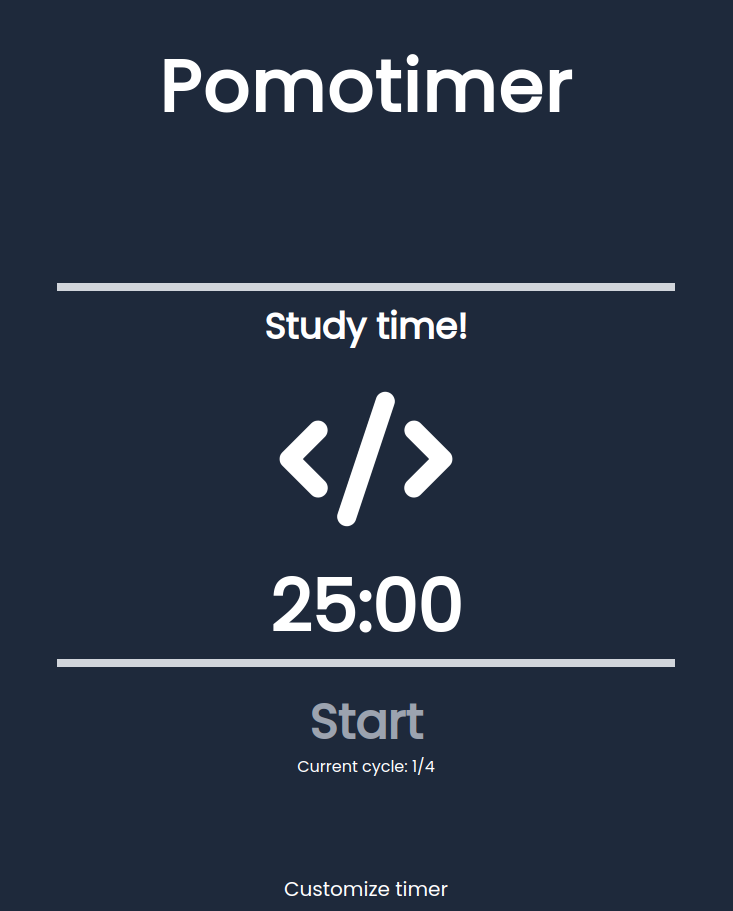
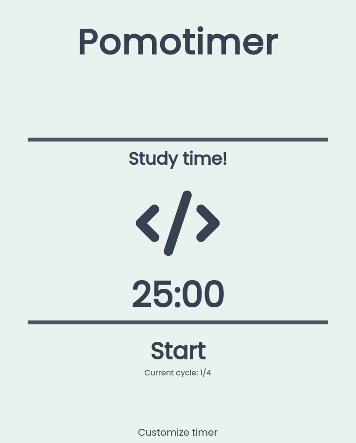
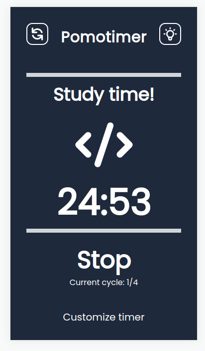
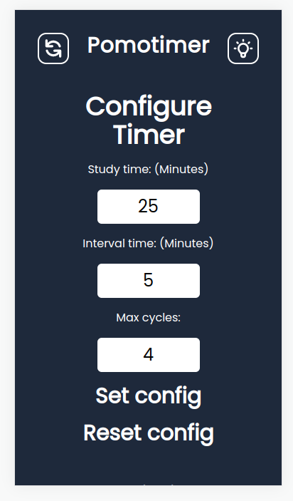

# Pomodoro Timer 🍅!

## 👀 Project Overview

- 😎 A pomodoro timer with customizable cycles to help with pomodoro study technique.
- 👨‍💻 React to easily build UI with TypeScript for Typing system (setInterval in React is a absolute nightmare). Tailwind for faster CSS writing. 
- I also want to use this project again to build a desktop app with Tauri.
- 🔗 You can find this project live on: https://pomo-timer.ribamarf01.dev/.

## 🔥 Techs used

<div style="
    display: inline-block
">
    
    
    
</div>

## 🔧 Build Setup

```bash
# install dependencies
$ npm install || yarn

# server with hot reload at localhost:3000
$ npm run dev || yarn dev

# build for production
$ npm run build || yarn build

# run the serverside app
$ npm run start || yarn start

```

## 📷 Project images






## 👽 External links

- 🔗 Wikipedia article about Pomodoro Technique: https://en.wikipedia.org/wiki/Pomodoro_Technique